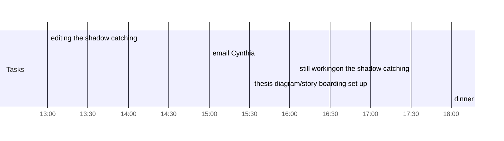

## Day Planner

- [x] 13:00 editing the shadow catching
- [x] 15:00 email Cynthia
- [x] 16:05 still workingon the shadow catching
- [x] 17:00 thesis diagram/story boarding set up
- [x] 18:00 dinner
      910, 750
      6:5